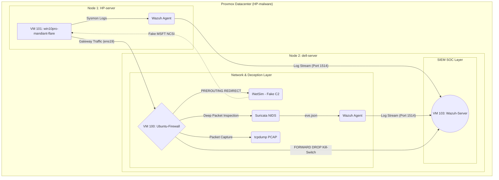

# Proxmox-Malware-Sandbox-SOC

Kiến Trúc @ giới thiệu dự án

## Enterprise-Grade Architecture & Traffic Flow
*(The diagram below renders automatically on GitHub via Mermaid.js)*

```mermaid
graph TD
    subgraph "Proxmox Datacenter (HP-malware)"
        
        subgraph "Node 1: HP-server"
            A[VM 101: win10pro-mandiant-flare] -->|Sysmon Logs| C(Wazuh Agent)
        end

        subgraph "Node 2: dell-server"
            subgraph "Network & Deception Layer"
                D{VM 100: Ubuntu-Firewall}
                E(INetSim - Fake C2)
                F(Suricata NIDS)
                P(tcpdump PCAP)
                
                A -- "Gateway Traffic (ens19)" --> D
                D -- "PREROUTING REDIRECT" --> E
                E -. "Fake MSFT NCSI" .-> A
                D -- "Deep Packet Inspection" --> F
                D -- "Packet Capture" --> P
                F -->|eve.json| G(Wazuh Agent)
            end

            subgraph "SIEM SOC Layer"
                H((VM 103: Wazuh-Server))
                C -- "Log Stream (Port 1514)" --> H
                G -- "Log Stream (Port 1514)" --> H
                D -- "FORWARD DROP Kill-Switch" --> H
            end
        end
    end
```
