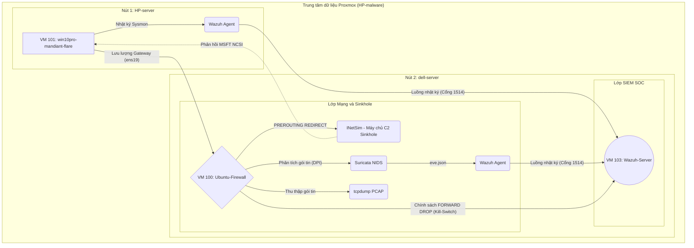

# Proxmox-Malware-Sandbox-SOC

Kiến trúc và Mô tả Dự án

## Kiến trúc Hệ thống và Luồng Dữ liệu
*(Sơ đồ luồng dữ liệu được hiển thị tự động qua Mermaid.js)*



## HƯỚNG DẪN TRIỂN KHAI HỆ THỐNG (DEPLOYMENT GUIDE)

Tài liệu này mô tả các bước kỹ thuật để thiết lập mới môi trường Sandbox và tích hợp SIEM theo sơ đồ kiến trúc đã định nghĩa.

### 1. Cấu hình Mạng (Network Topology)

*   **Wazuh Server (VM 103):** Địa chỉ IP `192.168.1.244` (Kết nối ra Internet qua NAT/Bridge).
*   **Ubuntu Gateway (VM 100):**
    *   Interface 1 (Internet/Management): `192.168.1.221` (ens18).
    *   Interface 2 (Host-only/Isolated LAN): `10.0.0.1` (ens19).
*   **Windows 10 Endpoint (VM 101):**
    *   Địa chỉ IP: `10.0.0.2` (Host-only/Isolated LAN).
    *   Default Gateway: `10.0.0.1`.
    *   DNS Server: `8.8.8.8` (Hoặc bất kỳ IP nào, do iptables sẽ chặn và chuyển hướng).

### 2. Triển khai Nút Gateway (Ubuntu - VM 100)

#### 2.1. Cài đặt phần mềm
Thực thi lệnh để cài đặt các dịch vụ cần thiết:
```bash
apt update
apt install -y inetsim suricata tcpdump iptables-persistent
```

#### 2.2. Thiết lập định tuyến mạng (Network Isolation & Routing)
Sử dụng tệp tin từ kho lưu trữ:
```bash
chmod +x scripts/01_iptables_routing.sh
./scripts/01_iptables_routing.sh
```

Hoặc cấu hình thủ công vào `/etc/iptables/rules.v4`:
```plaintext
*filter
:INPUT ACCEPT [0:0]
:FORWARD DROP [0:0]
:OUTPUT ACCEPT [0:0]
-A FORWARD -i ens19 -p tcp --dport 1514 -j ACCEPT
-A FORWARD -i ens19 -p tcp --dport 1515 -j ACCEPT
-A FORWARD -m state --state RELATED,ESTABLISHED -j ACCEPT
COMMIT
*nat
:PREROUTING ACCEPT [0:0]
:INPUT ACCEPT [0:0]
:OUTPUT ACCEPT [0:0]
:POSTROUTING ACCEPT [0:0]
-A PREROUTING -i ens19 -p tcp --dport 80 -j REDIRECT --to-port 80
-A PREROUTING -i ens19 -p tcp --dport 443 -j REDIRECT --to-port 443
-A PREROUTING -i ens19 -p udp --dport 53 -j REDIRECT --to-port 53
-A POSTROUTING -o ens18 -j MASQUERADE
COMMIT
```

Khởi động lại tiến trình netfilter:
```bash
netfilter-persistent reload
```

#### 2.3. Cấu hình dịch vụ INetSim
Sao chép tệp cấu hình:
```bash
cp configs/gateway/inetsim_sandbox.conf /etc/inetsim/inetsim.conf
```
Khởi động dịch vụ:
```bash
systemctl enable inetsim
systemctl restart inetsim
```

#### 2.4. Cấu hình dịch vụ Suricata (NIDS)
Sao chép tệp cấu hình:
```bash
cp configs/gateway/suricata_sandbox.yaml /etc/suricata/suricata.yaml
```
Khởi động dịch vụ:
```bash
systemctl enable suricata
systemctl restart suricata
```

#### 2.5. Thiết lập dịch vụ thu thập gói tin (Packet Capture)
Sao chép tệp service và kích chạy:
```bash
cp configs/gateway/tcpdump-dashcam.service /etc/systemd/system/malware-dashcam.service
mkdir -p /home/rootadmin/pcaps
systemctl daemon-reload
systemctl enable malware-dashcam
systemctl start malware-dashcam
```

#### 2.6. Cài đặt Wazuh Agent
Cài đặt Wazuh Agent và thay thế tệp cấu hình mặc định:
```bash
cp configs/gateway/wazuh_agent_gateway.xml /var/ossec/etc/ossec.conf
systemctl enable wazuh-agent
systemctl restart wazuh-agent
```

### 3. Triển khai Nút Endpoint (Windows 10 - VM 101)

#### 3.1. Cấu hình Mạng (Network Adapter)
Cấu hình IP tĩnh cho máy ảo Windows để đảm bảo mọi lưu lượng mạng đều bắt buộc phải đi qua tường lửa (Ubuntu Gateway). Việc thiết lập DNS thành `8.8.8.8` (hoặc bất kỳ IP nào khác) để kiểm chứng tính minh bạch của kiến trúc: iptables trên tường lửa sẽ tự động chặn và bẻ lái mọi truy vấn DNS về INetSim sinkhole mà máy ảo không hề hay biết.


#### 3.2. Thiết lập Sysmon
Tải tệp thi hành Sysmon và cài đặt với file cấu hình được chỉ định:
```cmd
sysmon64.exe -accepteula -i sysmon_config.xml
```

#### 3.3. Cấu hình Bypass NCSI (Giả mạo Internet)
*Lưu ý: Không cần cấu hình file `hosts` trên Windows.*
Tính năng vượt qua kiểm tra mạng của Windows (NCSI) được xử lý hoàn toàn tự động ở lớp Gateway. Kịch bản `scripts/02_fake_ncsi_bypass.sh` đã tạo sẵn các tệp tin phản hồi HTTP giả mạo (`connecttest.txt` và `ncsi.txt`) trên máy chủ INetSim. Kết hợp với việc iptables chuyển hướng toàn bộ truy vấn DNS (Cổng 53), máy ảo Windows sẽ tự động nhận được kết quả phân giải DNS giả từ tường lửa và bị đánh lừa rằng nó đang có kết nối Internet bình thường.

#### 3.4. Cài đặt Wazuh Agent
Cài đặt tác nhân Wazuh cho Windows. Thay thế cấu hình mặc định bằng tệp định tuyến log Sysmon:
```cmd
copy configs\endpoint\wazuh_agent_windows.xml "C:\Program Files (x86)\ossec-agent\ossec.conf"
```
Khởi động lại dịch vụ qua PowerShell:
```powershell
Restart-Service WazuhSvc
```

### 4. Triển khai Nút Trung tâm SIEM (Wazuh Server - VM 103)

#### 4.1. Khởi tạo bộ luật tĩnh (Custom Rules)
Đẩy tệp nhận diện mã độc vào đường dẫn lưu trữ luật của Wazuh Manager:
```bash
cp rules/wazuh_sysmon_detect.xml /var/ossec/etc/rules/local_rules.xml
```

Lưu ý: Tùy thuộc vào thiết lập lưu trữ, thay đổi quyền sở hữu tệp thành `wazuh:wazuh`.
```bash
chown wazuh:wazuh /var/ossec/etc/rules/local_rules.xml
```

#### 4.2. Khởi động lại trình quản lý
```bash
systemctl restart wazuh-manager
```
