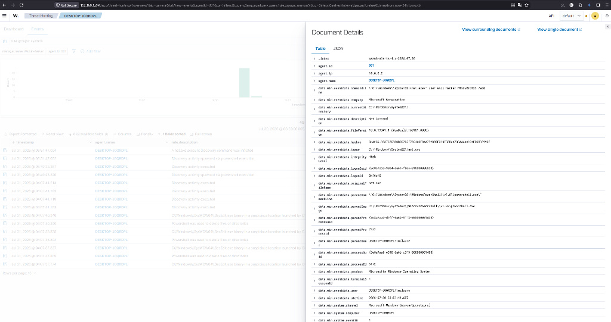
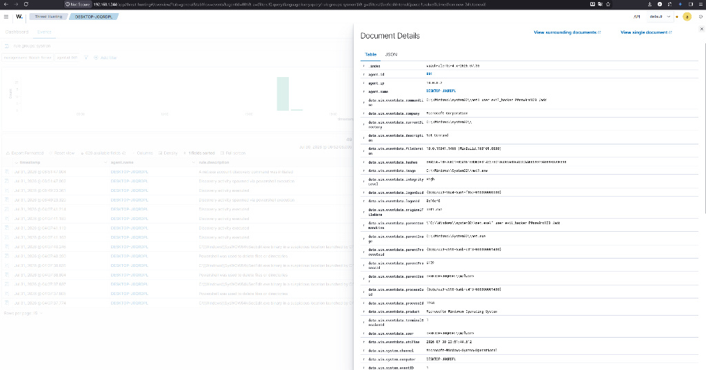
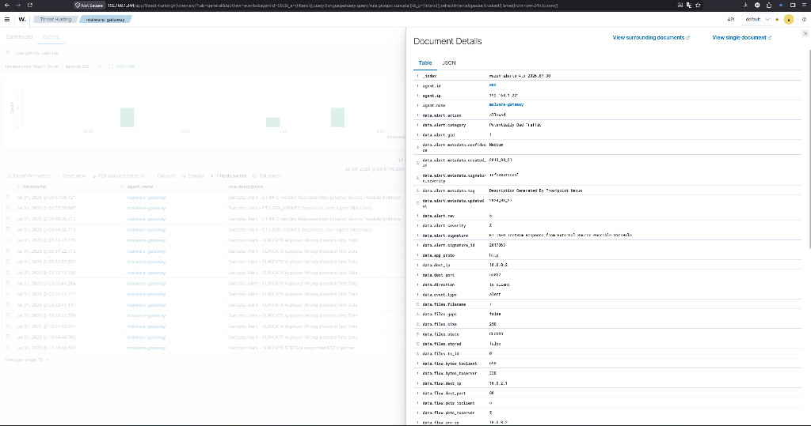

# Minh chứng khái niệm: Xác thực và Thực thi

Tài liệu này cung cấp các bản ghi nhật ký xác thực từ môi trường Proxmox, chứng minh rằng định tuyến Air-Gapped, luồng dữ liệu Telemetry và các Quy tắc phát hiện đang hoạt động.

## 1. Xác thực Cô lập mạng và Luồng dữ liệu Telemetry
**Mục tiêu:** Chứng minh rằng máy ảo Windows 10 (`10.0.0.2`) có thể vượt qua quy tắc `iptables DROP` dành riêng cho việc gửi dữ liệu SIEM (Cổng 1514), trong khi bị cô lập khỏi môi trường internet.

**Thực thi trên Windows 10 (FLARE-VM):**
```powershell
PS C:\Windows\system32 > Get-NetTCPConnection -RemoteAddress 192.168.1.244

LocalAddress        LocalPort RemoteAddress       RemotePort State       AppliedSetting
------------        --------- -------------       ---------- -----       --------------
10.0.0.2            54374     192.168.1.244       1514       Established Internet
```

## 2. Tạo dữ liệu Telemetry từ Endpoint (Sysmon EID 5)
**Mục tiêu:** Chứng minh rằng Sysmon đang giám sát endpoint, thu thập các sự kiện vòng đời tiến trình (tạo/kết thúc) và định dạng chúng cho Wazuh Agent.

**Thực thi trên Windows 10 (FLARE-VM):**
```powershell
PS C:\Windows\system32 > Get-WinEvent -LogName "Microsoft-Windows-Sysmon/Operational" -MaxEvents 1 | Select-Object TimeCreated, Message | Format-List

TimeCreated : 7/30/2026 2:38:38 PM
Message     : Process terminated:
              RuleName: -
              UtcTime: 2026-07-30 21:38:38.846
              ProcessGuid: {3e8a7aa9-c3e5-6a6b-4e13-000000001400}
              ProcessId: 6500
              Image: C:\Windows\servicing\TrustedInstaller.exe
              User: NT AUTHORITY\SYSTEM
```

## 3. SIEM Phát hiện và Cảnh báo (Wazuh & Suricata)
**Mục tiêu:** Chứng minh rằng SIEM (Wazuh) thu thập và tương quan nhật ký từ cả endpoint (Sysmon) và gateway mạng (Suricata), kích hoạt cảnh báo cho các hoạt động mạng.

**Thực thi trên Windows 10 (FLARE-VM):**
*(Lược bỏ phần lỗi - minh họa hoạt động truy vấn đặc quyền, tạo người dùng cục bộ và mô phỏng luồng dữ liệu C2)*

```powershell
PS C:\Windows\system32 > whoami /priv

PRIVILEGES INFORMATION
----------------------
Privilege Name                            Description                                                        State
========================================= ================================================================== ========
SeAssignPrimaryTokenPrivilege             Replace a process level token                                      Disabled
SeIncreaseQuotaPrivilege                  Adjust memory quotas for a process                                 Disabled
SeSecurityPrivilege                       Manage auditing and security log                                   Disabled
SeTakeOwnershipPrivilege                  Take ownership of files or other objects                           Disabled
SeLoadDriverPrivilege                     Load and unload device drivers                                     Disabled
SeSystemProfilePrivilege                  Profile system performance                                         Disabled
SeSystemtimePrivilege                     Change the system time                                             Disabled
SeProfileSingleProcessPrivilege           Profile single process                                             Disabled
SeIncreaseBasePriorityPrivilege           Increase scheduling priority                                       Disabled
SeCreatePagefilePrivilege                 Create a pagefile                                                  Disabled
SeBackupPrivilege                         Back up files and directories                                      Disabled
SeRestorePrivilege                        Restore files and directories                                      Disabled
SeShutdownPrivilege                       Shut down the system                                               Disabled
SeDebugPrivilege                          Debug programs                                                     Enabled
SeSystemEnvironmentPrivilege              Modify firmware environment values                                 Disabled
SeChangeNotifyPrivilege                   Bypass traverse checking                                           Enabled
SeRemoteShutdownPrivilege                 Force shutdown from a remote system                                Disabled
SeUndockPrivilege                         Remove computer from docking station                               Disabled
SeManageVolumePrivilege                   Perform volume maintenance tasks                                   Disabled
SeImpersonatePrivilege                    Impersonate a client after authentication                          Enabled
SeCreateGlobalPrivilege                   Create global objects                                              Enabled
SeIncreaseWorkingSetPrivilege             Increase a process working set                                     Disabled
SeTimeZonePrivilege                       Change the time zone                                               Disabled
SeCreateSymbolicLinkPrivilege             Create symbolic links                                              Disabled
SeDelegateSessionUserImpersonatePrivilege Obtain an impersonation token for another user in the same session Disabled

PS C:\Windows\system32 > net user evil_hacker P@ssw0rd123 /add
The command completed successfully.

PS C:\Windows\system32 > curl -UseBasicParsing http://testmyids.com

StatusCode        : 200
StatusDescription : OK
Content           : <html>...<title>INetSim default HTML page</title>...</html>...

PS C:\Windows\system32 > curl -UseBasicParsing -UserAgent "BlackSun" http://10.0.2.1

StatusCode        : 200
StatusDescription : OK
Content           : <html>...<title>INetSim default HTML page</title>...</html>...
```

### 3.1. Phát hiện trên Endpoint (Sysmon qua Wazuh)
*Wazuh phát hiện các hoạt động endpoint thông qua Sysmon, bao gồm việc truy vấn đặc quyền và tạo người dùng cục bộ.*

**Cảnh báo 1: Hoạt động Truy vấn Đặc quyền**
*Phát hiện thực thi lệnh `whoami /priv` (Sysmon Event ID 1).*


**Cảnh báo 2: Tạo Người dùng**
*Phát hiện hoạt động tạo tài khoản người dùng cục bộ (`evil_hacker`) qua Sysmon Event ID 1.*


### 3.2. Phát hiện trên Mạng (Suricata qua Wazuh)
*Wazuh tổng hợp cảnh báo Suricata NIDS, phát hiện truy vấn `testmyids.com` và User-Agent `BlackSun` kết nối tới INetSim sinkhole.*



## 4. Minh chứng Cơ chế Chuyển hướng DNS và Bypass NCSI
**Mục tiêu:** Khẳng định máy ảo Windows được cấu hình trỏ Default Gateway về tường lửa và truy vấn máy chủ DNS ngoại mạng, kiểm chứng khả năng can thiệp lưu lượng ở tầng mạng của iptables.


